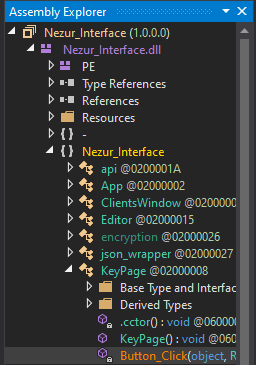

# Finding the Correct Path

## Make sure you have added the DLL inside of dnSpy!

once you have added the DLL, you are gonna need the path to get the Right code, here is how to find the path

1. **Finding the needed code's Path:**\
   Nezur\_Interface (1.0.0.0) \
   &#x20;  ├── Nezur\_Interface.dll\
   &#x20;        └── Nezur\_Interface\
   &#x20;               └── KeyPage\
   &#x20;                       └── Button\_Click

<figure><figcaption>
This is an exemple of the path
</figcaption></figure>

